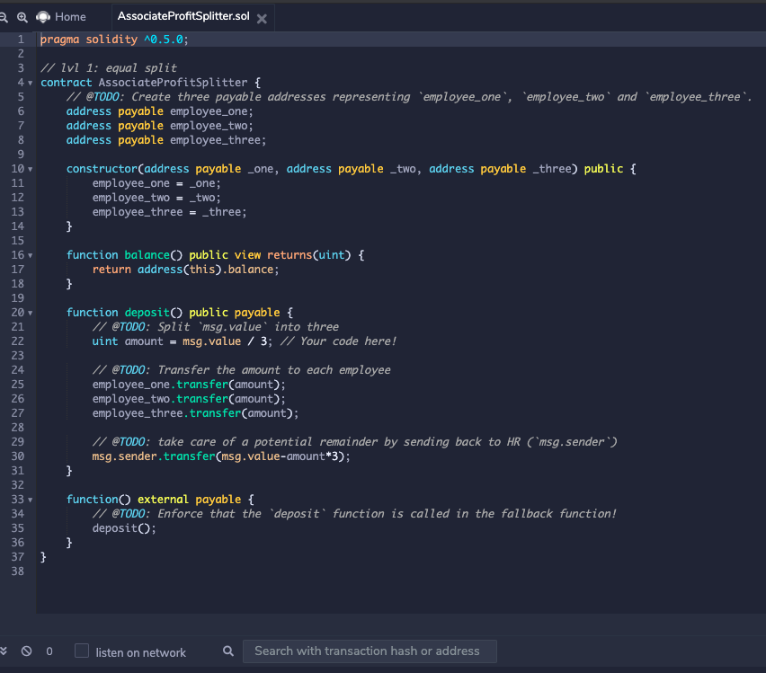
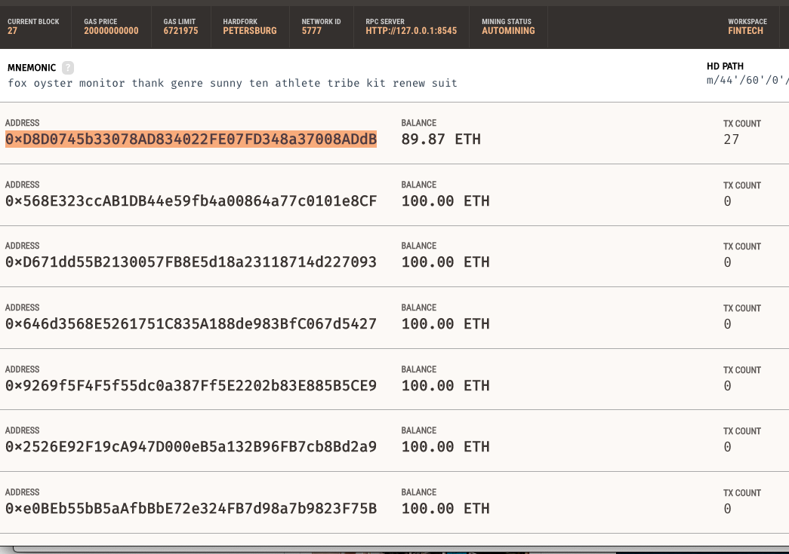
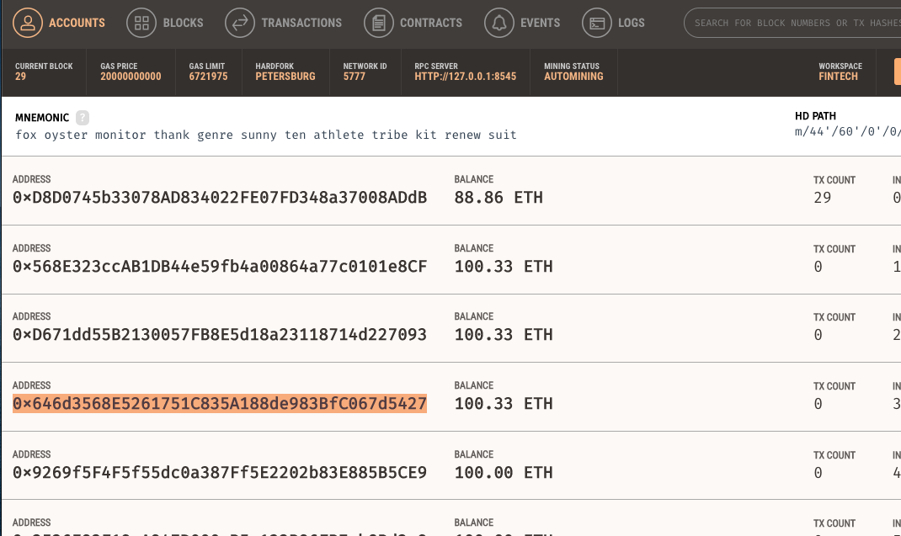
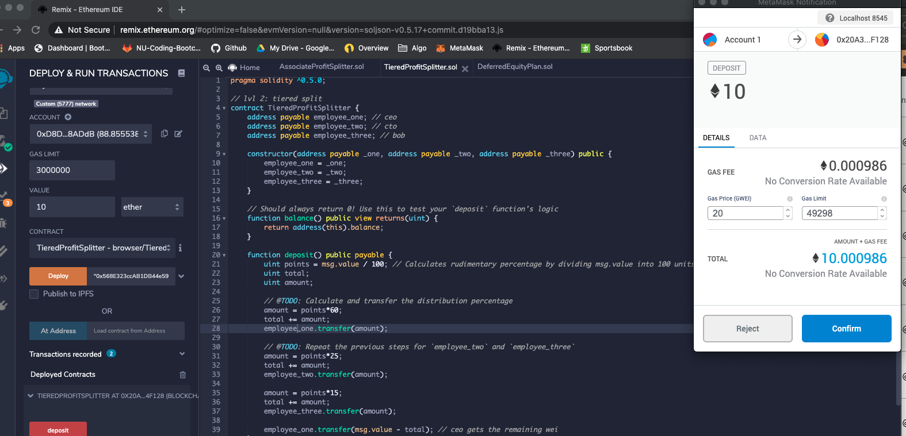
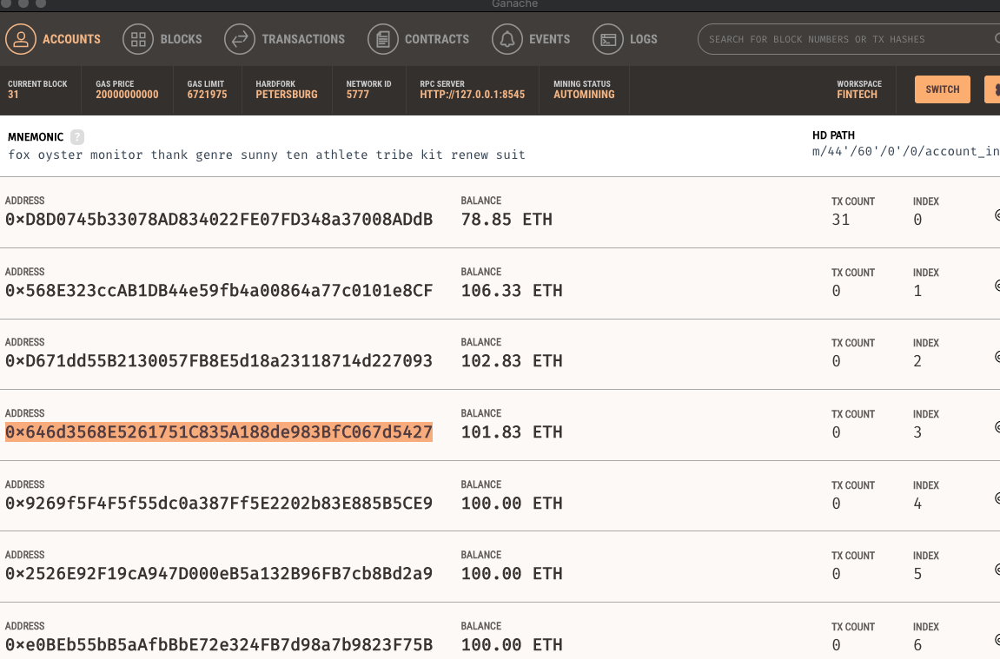
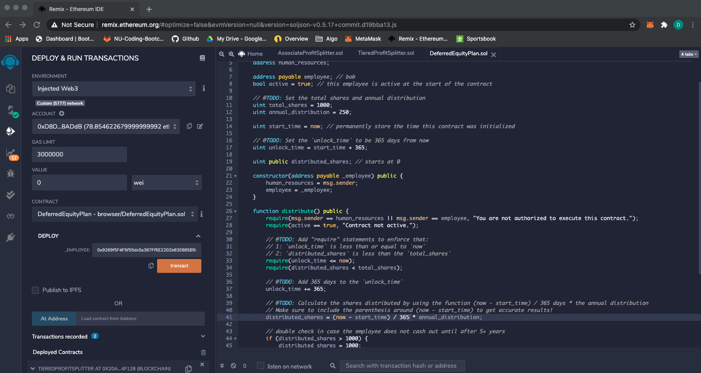

# Smart-Contracts
Basic smart contracts developed via Solidity

In this exercise, we'll be developing and deploying 3 Smart Contracts of increasing complexity using the following tools: Remix (Solidity IDE), Metamask (Eth Wallet & Deployment Solution), Ganache (Eth Blockchain)

## Associate Profit Splitter
This contract distributes employee profits evenly per the below code, and places the balance back into owners acct

After deploying the contract and distibuting 1 Ether, we can see this reflected within Ganache
Initial state of the 3 employee IDs (2-4)

And next is a view of the IDs after distribution of the 1 Ether

********************************************************************
## Tiered Profit Splitter
This tiered contract distributes profits in accordance with an employees place in the corporate hierarchy. In this case, 60/25/15 per the below code:

The above screen also depicts 10 Ether being distributed, which is also reflected per the below balances in Ganache:

## Deferred Equity Plan
This contract releases equity on an annual basis beginning with day 1 of employment (code found below)

